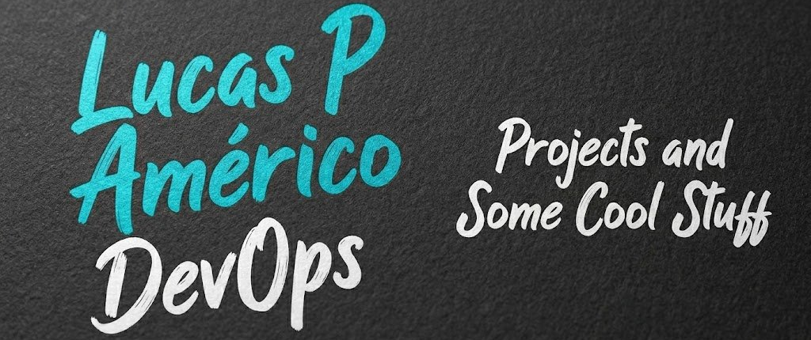

### Hello, folks! 

My name is **Lucas Pedro Américo** and I am focused on DevOps and Kubernetes projects. You can find me on [LinkedIn](https://www.linkedin.com/in/lucas-pedro-am%C3%A9rico/).

### 🔧 Technologies & Tools

<!-- Badges from Shields.io -->

### 📈 GitHub Stats

<!-- GitHub stats cards generated automatically based on your username (LPA-K8s) -->

  
  

